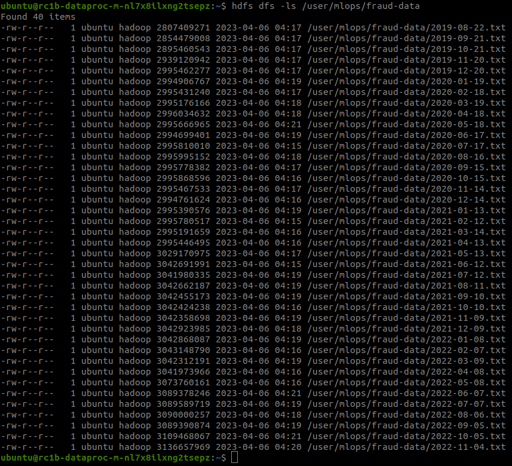

# Настройка облачной инфраструктуры

## Создание бакета

Создаём бакет с помощью `s3cmd`

```shell
> s3cmd mb s3://melnikov-mlops

Bucket 's3://melnikov-mlops/' created
```

Открываем бакет для чтения с помощью `yc`

```shell
> yc storage bucket update --name melnikov-mlops --public-read --folder-id=b1g1enffqq7ql8kv0d6q

name: melnikov-mlops
folder_id: b1g1enffqq7ql8kv0d6q
anonymous_access_flags:
  read: true
default_storage_class: STANDARD
versioning: VERSIONING_DISABLED
acl: {}
created_at: "2023-04-03T06:08:06.029439Z"
```

## Создание Spark-кластера

Создаём группу безопасности. Если в выбранных группах безопасности не будет необходимых правил, Yandex Cloud заблокирует создание кластера.

```shell
> yc vpc security-group create \
  --name melnikov-dpc-sg \
  --folder-id=b1g1enffqq7ql8kv0d6q \
  --rule "direction=ingress,from-port=0,to-port=65535,protocol=any,predefined=self_security_group" \
  --rule "direction=egress,from-port=0,to-port=65535,protocol=any,predefined=self_security_group" \
  --rule "direction=ingress,port=443,protocol=tcp,v4-cidrs=[0.0.0.0/0]" \
  --rule "direction=egress,port=443,protocol=tcp,v4-cidrs=[0.0.0.0/0]" \
  --rule "direction=ingress,port=22,protocol=tcp,v4-cidrs=[0.0.0.0/0]" \
  --network-id enpl6sb35jbtb7jtink3
  
id: enpcsede8k3pmdesievc
folder_id: b1g1enffqq7ql8kv0d6q
created_at: "2023-04-06T03:41:01Z"
name: melnikov-dpc-sg
network_id: enpl6sb35jbtb7jtink3
status: ACTIVE
rules:
  - id: enpmg3su3oov5g4c9d3k
    direction: INGRESS
    ports:
      to_port: "65535"
    protocol_name: ANY
    protocol_number: "-1"
    predefined_target: self_security_group
  - id: enp5dk6sdpd0h3u5sbdn
    direction: EGRESS
    ports:
      to_port: "65535"
    protocol_name: ANY
    protocol_number: "-1"
    predefined_target: self_security_group
  - id: enp6prudo8632n9ipsj4
    direction: INGRESS
    ports:
      from_port: "443"
      to_port: "443"
    protocol_name: TCP
    protocol_number: "6"
    cidr_blocks:
      v4_cidr_blocks:
        - 0.0.0.0/0
  - id: enp28gmdnbfqt00qque0
    direction: EGRESS
    ports:
      from_port: "443"
      to_port: "443"
    protocol_name: TCP
    protocol_number: "6"
    cidr_blocks:
      v4_cidr_blocks:
        - 0.0.0.0/0
  - id: enpv2qj2m4u1nujtqld9
    direction: INGRESS
    ports:
      from_port: "22"
      to_port: "22"
    protocol_name: TCP
    protocol_number: "6"
    cidr_blocks:
      v4_cidr_blocks:
        - 0.0.0.0/0        
```

Создаём кластер

```shell
> yc dataproc cluster create melnikov-dpc \
   --folder-id=b1g1enffqq7ql8kv0d6q \
   --bucket=melnikov-mlops \
   --zone=ru-central1-b \
   --service-account-name=assistant \
   --ssh-public-keys-file=/home/miller/.ssh/id_rsa.pub \
   --subcluster name=dpc-master,`
               `role=masternode,`
               `resource-preset=s3-c2-m8,`
               `disk-type=network-ssd,`
               `disk-size=40,`
               `subnet-name=default-ru-central1-b,`
               `assign-public-ip=true \
   --subcluster name=dpc-data,`
               `role=datanode,`
               `resource-preset=s3-c4-m16,`
               `disk-type=network-hdd,`
               `disk-size=128,`
               `subnet-name=default-ru-central1-b,`
               `hosts-count=3,`
               `assign-public-ip=false \
   --deletion-protection=false \
   --ui-proxy=true \
   --security-group-ids=enpcsede8k3pmdesievc
   
done (5m17s)
id: c9qdv7lhukhcldppd7ia
folder_id: b1g1enffqq7ql8kv0d6q
created_at: "2023-04-06T03:44:13.090009Z"
name: melnikov-dpc
config:
  version_id: "2.0"
  hadoop:
    services:
      - HDFS
      - YARN
      - MAPREDUCE
      - TEZ
      - ZOOKEEPER
      - HBASE
      - HIVE
      - SQOOP
      - FLUME
      - OOZIE
    ssh_public_keys:
      - ssh-rsa AAAAB3NzaC1yc2EAAAADAQABAAABgQDpz+FTAPoTy1kDfzR7wLrhiPEqQCz85+5YgrPVp87JNRWFo5rOtdGzMKNSTuGIaOAggaVbGZDqB41f08iGHIfwNmxHZ3N53bi9gSHceKbSpn7nEWh1eqpVgp/dunWBP83R9hCgjUbKmnYzfwUDHdAUPIMJiBZ3jMfJx4aBT3m5vsGFpL620N/j4s5GwuKWsnIxcyckduIVyTD8La05O270gHIv2r85i/Z5Gsy5lpjoq7XFZNjgFm7dyG6k9qSXy/+jpRxsvZwZQnX4nnhZTAcu/j9SfhmOYOtE7Os8C09VxiJoi6ky2nkduFKZSqyxg+VdOtS5srvHxSFAR5wH1sXFgoppCAN1Hr9BbfK1I6B3UCTXRV0mDjdiAnrWCQepEyRmMwDr9HRGa3dP7tNre4Frxq0bZ7mvwiNCijGgRIJzbs+b/9ywRinxX+GPPAwMKqv+D5EjWgwSoi7uGVRCqL5jR4GkX3X/xVbiJFaH8fCId/L9ZSdIMXSjwFLxDh5NbKU= miller@ideacentre
health: ALIVE
zone_id: ru-central1-b
service_account_id: ajeviacu5jeo3d5havp3
bucket: melnikov-mlops
ui_proxy: true
security_group_ids:
  - enpcsede8k3pmdesievc
```

## Копирование данных

Создаём целевую директорию в HDFS

```shell
> hdfs dfs -mkdir /user/mlops
```

Копируем файлы из заданного бакета с помощью команды `hadoop distcp`

```shell
> hadoop distcp s3a://mlops-data/fraud-data/ /user/mlops/

2023-04-06 04:14:16,312 INFO tools.DistCp: Input Options: DistCpOptions{atomicCommit=false, syncFolder=false, deleteMissing=false, ignoreFailures=false, overwrite=false, append=false, useDiff=false, useRdiff=false, fromSnapshot=null, toSnapshot=null, skipCRC=false, blocking=true, numListstatusThreads=0, maxMaps=20, mapBandwidth=0.0, copyStrategy='uniformsize', preserveStatus=[], atomicWorkPath=null, logPath=null, sourceFileListing=null, sourcePaths=[s3a://mlops-data/fraud-data], targetPath=/user/mlops, filtersFile='null', blocksPerChunk=0, copyBufferSize=8192, verboseLog=false, directWrite=false}, sourcePaths=[s3a://mlops-data/fraud-data], targetPathExists=true, preserveRawXattrsfalse
2023-04-06 04:14:16,640 INFO client.RMProxy: Connecting to ResourceManager at rc1b-dataproc-m-nl7x8ilxng2tsepz.mdb.yandexcloud.net/10.129.0.11:8032
2023-04-06 04:14:16,807 INFO client.AHSProxy: Connecting to Application History server at rc1b-dataproc-m-nl7x8ilxng2tsepz.mdb.yandexcloud.net/10.129.0.11:10200
2023-04-06 04:14:16,996 INFO impl.MetricsConfig: Loaded properties from hadoop-metrics2.properties
2023-04-06 04:14:17,076 INFO impl.MetricsSystemImpl: Scheduled Metric snapshot period at 10 second(s).
2023-04-06 04:14:17,077 INFO impl.MetricsSystemImpl: s3a-file-system metrics system started
2023-04-06 04:14:20,065 INFO tools.SimpleCopyListing: Paths (files+dirs) cnt = 41; dirCnt = 1
2023-04-06 04:14:20,065 INFO tools.SimpleCopyListing: Build file listing completed.
2023-04-06 04:14:20,066 INFO Configuration.deprecation: io.sort.mb is deprecated. Instead, use mapreduce.task.io.sort.mb
2023-04-06 04:14:20,066 INFO Configuration.deprecation: io.sort.factor is deprecated. Instead, use mapreduce.task.io.sort.factor
2023-04-06 04:14:20,575 INFO tools.DistCp: Number of paths in the copy list: 41
2023-04-06 04:14:20,634 INFO tools.DistCp: Number of paths in the copy list: 41
2023-04-06 04:14:20,652 INFO client.RMProxy: Connecting to ResourceManager at rc1b-dataproc-m-nl7x8ilxng2tsepz.mdb.yandexcloud.net/10.129.0.11:8032
2023-04-06 04:14:20,653 INFO client.AHSProxy: Connecting to Application History server at rc1b-dataproc-m-nl7x8ilxng2tsepz.mdb.yandexcloud.net/10.129.0.11:10200
2023-04-06 04:14:20,737 INFO mapreduce.JobResourceUploader: Disabling Erasure Coding for path: /tmp/hadoop-yarn/staging/ubuntu/.staging/job_1680752908243_0004
2023-04-06 04:14:20,964 INFO mapreduce.JobSubmitter: number of splits:31
2023-04-06 04:14:21,542 INFO mapreduce.JobSubmitter: Submitting tokens for job: job_1680752908243_0004
2023-04-06 04:14:21,542 INFO mapreduce.JobSubmitter: Executing with tokens: []
2023-04-06 04:14:21,795 INFO conf.Configuration: resource-types.xml not found
2023-04-06 04:14:21,795 INFO resource.ResourceUtils: Unable to find 'resource-types.xml'.
2023-04-06 04:14:21,883 INFO impl.YarnClientImpl: Submitted application application_1680752908243_0004
2023-04-06 04:14:21,942 INFO mapreduce.Job: The url to track the job: http://rc1b-dataproc-m-nl7x8ilxng2tsepz.mdb.yandexcloud.net:8088/proxy/application_1680752908243_0004/
2023-04-06 04:14:21,943 INFO tools.DistCp: DistCp job-id: job_1680752908243_0004
2023-04-06 04:14:21,943 INFO mapreduce.Job: Running job: job_1680752908243_0004
2023-04-06 04:14:28,042 INFO mapreduce.Job: Job job_1680752908243_0004 running in uber mode : false
2023-04-06 04:14:28,043 INFO mapreduce.Job:  map 0% reduce 0%
2023-04-06 04:14:44,495 INFO mapreduce.Job:  map 2% reduce 0%
2023-04-06 04:14:46,567 INFO mapreduce.Job:  map 3% reduce 0%
2023-04-06 04:14:47,585 INFO mapreduce.Job:  map 13% reduce 0%
2023-04-06 04:14:48,591 INFO mapreduce.Job:  map 16% reduce 0%
2023-04-06 04:14:49,601 INFO mapreduce.Job:  map 19% reduce 0%
2023-04-06 04:14:50,621 INFO mapreduce.Job:  map 21% reduce 0%
2023-04-06 04:15:51,138 INFO mapreduce.Job:  map 23% reduce 0%
2023-04-06 04:15:53,157 INFO mapreduce.Job:  map 24% reduce 0%
2023-04-06 04:15:54,161 INFO mapreduce.Job:  map 26% reduce 0%
2023-04-06 04:16:18,316 INFO mapreduce.Job:  map 27% reduce 0%
2023-04-06 04:16:24,356 INFO mapreduce.Job:  map 32% reduce 0%
2023-04-06 04:16:25,360 INFO mapreduce.Job:  map 34% reduce 0%
2023-04-06 04:16:27,369 INFO mapreduce.Job:  map 35% reduce 0%
2023-04-06 04:16:39,448 INFO mapreduce.Job:  map 39% reduce 0%
2023-04-06 04:16:46,475 INFO mapreduce.Job:  map 42% reduce 0%
2023-04-06 04:17:23,956 INFO mapreduce.Job:  map 48% reduce 0%
2023-04-06 04:17:24,968 INFO mapreduce.Job:  map 52% reduce 0%
2023-04-06 04:18:12,300 INFO mapreduce.Job:  map 55% reduce 0%
2023-04-06 04:18:15,310 INFO mapreduce.Job:  map 58% reduce 0%
2023-04-06 04:18:17,329 INFO mapreduce.Job:  map 65% reduce 0%
2023-04-06 04:18:18,333 INFO mapreduce.Job:  map 71% reduce 0%
2023-04-06 04:18:31,506 INFO mapreduce.Job:  map 74% reduce 0%
2023-04-06 04:18:33,598 INFO mapreduce.Job:  map 77% reduce 0%
2023-04-06 04:18:43,784 INFO mapreduce.Job:  map 84% reduce 0%
2023-04-06 04:18:44,793 INFO mapreduce.Job:  map 87% reduce 0%
2023-04-06 04:20:05,191 INFO mapreduce.Job:  map 100% reduce 0%
2023-04-06 04:21:15,406 INFO mapreduce.Job: Job job_1680752908243_0004 completed successfully
2023-04-06 04:21:15,502 INFO mapreduce.Job: Counters: 43
	File System Counters
		FILE: Number of bytes read=0
		FILE: Number of bytes written=7510918
		FILE: Number of read operations=0
		FILE: Number of large read operations=0
		FILE: Number of write operations=0
		HDFS: Number of bytes read=19774
		HDFS: Number of bytes written=120594553665
		HDFS: Number of read operations=400
		HDFS: Number of large read operations=0
		HDFS: Number of write operations=214
		HDFS: Number of bytes read erasure-coded=0
		S3A: Number of bytes read=120594553665
		S3A: Number of bytes written=0
		S3A: Number of read operations=81
		S3A: Number of large read operations=0
		S3A: Number of write operations=0
	Job Counters 
		Launched map tasks=31
		Other local map tasks=31
		Total time spent by all maps in occupied slots (ms)=11287101
		Total time spent by all reduces in occupied slots (ms)=0
		Total time spent by all map tasks (ms)=3762367
		Total vcore-milliseconds taken by all map tasks=3762367
		Total megabyte-milliseconds taken by all map tasks=11557991424
	Map-Reduce Framework
		Map input records=41
		Map output records=0
		Input split bytes=4216
		Spilled Records=0
		Failed Shuffles=0
		Merged Map outputs=0
		GC time elapsed (ms)=13955
		CPU time spent (ms)=1500300
		Physical memory (bytes) snapshot=30831947776
		Virtual memory (bytes) snapshot=135805943808
		Total committed heap usage (bytes)=23638573056
		Peak Map Physical memory (bytes)=1073754112
		Peak Map Virtual memory (bytes)=4435402752
	File Input Format Counters 
		Bytes Read=15558
	File Output Format Counters 
		Bytes Written=0
	DistCp Counters
		Bandwidth in Btyes=1092205030
		Bytes Copied=120594553665
		Bytes Expected=120594553665
		Files Copied=40
		DIR_COPY=1
2023-04-06 04:21:15,506 INFO impl.MetricsSystemImpl: Stopping s3a-file-system metrics system...
2023-04-06 04:21:15,506 INFO impl.MetricsSystemImpl: s3a-file-system metrics system stopped.
2023-04-06 04:21:15,506 INFO impl.MetricsSystemImpl: s3a-file-system metrics system shutdown complete.
```

Выводим список файлов



## Оценка ресурсов

Сравнение стоимости ресурсов

- SSD **дороже** HDD x4
- SSD без репликации **дешевле** x1.5
- Object Storage **дешевле** SSD x6
- Object Storage **дешевле** HDD x2
- RAM прерываемой ВМ **дешевле** x4
- CPU прерываемой ВМ **дешевле** x4

## Обновление списка задач

См. [Backlog](https://github.com/users/melnikk/projects/3/views/1)

## Удаление кластера

```shell
> yc dataproc cluster delete --id c9qdv7lhukhcldppd7ia

id: c9qtvmohs9ga842du4mc
description: Delete Data Proc cluster
created_at: "2023-04-06T12:38:35.341297Z"
created_by: ajet8v45shrtai705npm
modified_at: "2023-04-06T12:38:35.341297Z"
metadata:
  '@type': type.googleapis.com/yandex.cloud.dataproc.v1.DeleteClusterMetadata
  cluster_id: c9qdv7lhukhcldppd7ia
```