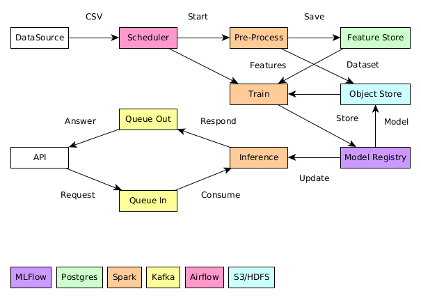

# Freud
Проект Anti-fraud системы

## Цели системы
- Снизить ущерб от мошеннических операций за счёт автоматизации оценки транзакции пользователей
- Снизить нагрузку на операторов, обрабатывающих случаи мошенничества

## Метрики машинного обучения
- Receiver Operation Characteristic - Area Under Curve - можем управлять FPR, хорошие показатели на разбалансированных данных

## Особенности проекта
Для анализа и выявления особенностей проекта используем шаблон [MISSION](https://medium.com/product-ai/mission-canvas-never-start-a-research-project-without-a-shared-mission-understanding-83653492b34)

### Mетрики (Metrics, Money, and Milestones)
- Бюджет - 10 млн. рублей
- Срок MVP (go-not-go) - 3 месяца
- Срок проекта - 6 месяцев
- Ущерб клиентов / мес - <= 500 тыс.руб
- Допустимый FP - <5% (минимизируем)
- RPS - 50 транзакций/сек
- Пиковый RPS - 400 транзакций/сек
- Допустимая задержка (latency) - **? сек**

### Идеи
- [Machine Learning System for Fraud Detection. A Methodological Approach for a Development Platform](https://www.researchgate.net/publication/352834391)
- [Fraud Detection Handbook](https://fraud-detection-handbook.github.io/)

### Стратегия (and Support from Sponsors)
- Развитие системы (нужна подсистема переобучения)

### Навыки (Skills)
- **Системный аналитик**
- Дата-инженер
- Дата-сатанист
- Разработчик
- Эксперт по финансовым операциям - нужен от заказчика
- Эксперт по мошенникам (СБ) - нужен от заказчика

### Вход (Input)
- Данные разбиты на csv-файлы
- Одна строка - одна транзакция
- Содержат **конфиденциальные** данные клиента

### Выход (Output)
- True / False
- Score
- Latency / Duration
- Prediction Rate
- Error Rate
- Resource Utilization
- Saturation (Размер очереди на обработку)

### Ньюансы
- В требованиях есть слова **в реальном времени**, а данных по допустимому latency нет
- Дисбаланс в данных - TP <=2% из общего числа - **?**
- Данные разбиты в файлы по дням **?** (периодический сбор данных - раз в сутки)
- Файлы с данными содержат конфиденциальную информацию. Утечка недопустима.
- Компания не готова размещать систему на собственных ресурсах (нужна облачная инфраструктура, но **как обеспечить устойчивость к утечкам?**)
- В модели появляются сдвиги (мошенники и пользователи изменяют поведение со временем, нужен трекинг и переобучение)

## Компоненты системы

- API - k8s app
- Брокер сообщений - Kafka
- Шедулер - AirFlow
- Процессор - Spark
- Объектное Хранилище - S3/HDFS (датасеты/модели)
- SQL-хранилище - Postgres - (размеченные данные)
- Трекер моделей / Model Registry - MLFlow

## Задачи
- [Backlog](https://github.com/users/melnikk/projects/3/views/1)
